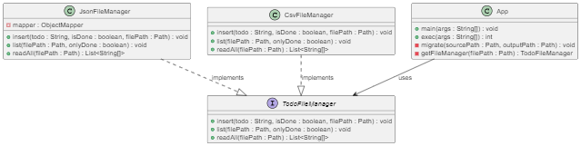

# L3 design pattern report

- **Firstname**: Ouail
- **Lastname**: LEKHCHINE


## Refactorisation du Code Java avec les Principes SOLID

### Application des Principes SOLID

#### Single Responsibility Principle (SRP)

- **Séparation des Responsabilités** : Le code a été divisé en classes distinctes avec des responsabilités uniques, telles que la manipulation des fichiers (`CsvFileManager` et `JsonFileManager`) et le traitement des commandes d'insertion et de listage.

#### Open/Closed Principle (OCP)

- **Extensibilité** : Une interface `TodoFileManager` a été créée pour permettre l'extension à d'autres formats de fichiers sans modifier le code existant.

#### Liskov Substitution Principle (LSP)

- Les classes implémentant `TodoFileManager` peuvent être substituées sans affecter le comportement attendu, permettant une flexibilité dans le choix du format de fichier.

#### Interface Segregation Principle (ISP)

- Les interfaces ont été conçues pour être spécifiques aux besoins des clients qui les utilisent, évitant ainsi les dépendances inutiles.

#### Dependency Inversion Principle (DIP)

- Le code de haut niveau ne dépend pas des détails de mise en œuvre des classes de bas niveau mais des abstractions, facilitant ainsi la gestion des dépendances.

### Architecture du Code

L'architecture refactorisée implémente `TodoFileManager` pour gérer les opérations de fichier, avec deux implémentations concrètes pour les formats CSV et JSON. Cela démontre l'application des principes SOLID pour améliorer la structure du code.

```java
interface TodoFileManager {
    void insert(String todo, Path filePath) throws IOException;
    void list(Path filePath) throws IOException;
}
```

#### Implémentations Spécifiques

- **CsvFileManager** : Gère les fichiers CSV.
- **JsonFileManager** : Gère les fichiers JSON.

### Main Application (`App.java`)

La classe principale `App` utilise `TodoFileManager` pour déléguer les opérations d'insertion et de listage à l'implémentation appropriée en fonction du type de fichier spécifié.

### Conclusion

Cette refactorisation a pour but de rendre l'application plus facile à maintenir et à étendre, notamment en facilitant l'ajout de nouveaux formats de fichiers ou de nouvelles commandes sans impacter le code existant. L'application est désormais mieux structurée, avec des composants clairement définis suivant les principes SOLID.


----------------------------------------------------------------------------------------------------------------------------------------------------------
TP02 : 
## Modifications Apportées

### Interface `TodoFileManager`

- **Ajout de Paramètres** : Modification de la signature des méthodes pour inclure la gestion de l'état des tâches (faites ou non) et pour permettre de filtrer les tâches lors de l'affichage.

  ```java
  void insert(String todo, boolean isDone, Path filePath) throws IOException;
  void list(Path filePath, boolean onlyDone) throws IOException;
  ```

### Classe `JsonFileManager`

- **Gestion de l'État des Tâches** : Adaptation pour créer et traiter des objets JSON incluant un champ `"done"` indiquant si une tâche est faite.

- **Vérification des Nullités** : Ajout de vérifications pour éviter les `NullPointerException` lors de la lecture des champs `"task"` et `"done"` des objets JSON.

### Classe `CsvFileManager`

- **Adaptation pour l'État des Tâches** : Modification pour inclure l'état des tâches (faites ou non) dans le fichier CSV et pour filtrer lors de l'affichage.

### Classe `App`

- **Gestion des Arguments CLI** : Ajout de l'option `--done` pour marquer les tâches comme faites lors de l'ajout et pour filtrer les tâches faites lors de l'affichage.

## Correction des Erreurs

- **NullPointerException** : Correction des erreurs causées par des tentatives d'accès à des champs non existants dans les objets JSON, en ajoutant des vérifications de nullité avant d'accéder aux champs `"task"` et `"done"`.

## Code Final Adapté

Les modifications ont été intégrées à travers les différentes classes pour prendre en charge les nouvelles fonctionnalités demandées et pour corriger les erreurs identifiées. Voici les points clés de l'implémentation :

- **Insertion et Liste des Tâches** : Les tâches peuvent désormais être ajoutées avec un état (fait ou non fait), et l'affichage des tâches peut être filtré pour montrer uniquement celles qui sont marquées comme faites.

- **Robustesse** : Le code a été rendu plus robuste par la gestion appropriée des cas où les données attendues pourraient être manquantes ou mal formées.
---------------------------------------------------------------------
TP 03 : 

# Gestion des Tâches TODO

## Introduction
Ce document présente un résumé des choix de conception et des motifs de conception utilisés dans le cadre du TP sur la gestion des tâches TODO.

## Choix de Design Pattern
Les principaux motifs de conception utilisés dans cette application sont **le pattern Strategy** et **le pattern Command** pour structurer le code de manière flexible et maintenable.

### Pattern Strategy
Le pattern Strategy est utilisé pour définir une famille d'algorithmes, encapsuler chacun d'eux et les rendre interchangeables. Dans notre cas, `TodoFileManager` agit comme la stratégie de base pour les opérations sur les fichiers TODO, avec deux stratégies concrètes : `JsonFileManager` et `CsvFileManager`. Cela permet d'ajouter facilement de nouveaux formats de fichier sans modifier le code client.

### Pattern Command
Le pattern Command est employé pour encapsuler une demande en tant qu'objet, permettant ainsi de paramétrer les clients avec des requêtes, des files d'attente ou des opérations. Bien que non explicitement défini dans le code, ce motif est impliqué par la structure des opérations `insert`, `list`, et `migrate` qui peuvent être considérées comme des commandes.

## Impact sur la Base de Code
L'utilisation de ces motifs de conception rend le code plus modulaire, facile à étendre et à maintenir. Par exemple, l'ajout d'un nouveau format de fichier ne nécessite que la création d'une nouvelle classe implémentant `TodoFileManager`. De même, la modification ou l'ajout de nouvelles commandes (opérations) est simplifiée grâce à cette structure flexible.

## Diagramme de Classe
Ci-dessous, le diagramme de classe UML illustre la structure du code :
```mermaid
classDiagram
    class TodoFileManager {
      <<interface>>
      +insert(String todo, boolean isDone, Path filePath) void
      +list(Path filePath, boolean onlyDone) void
      +readAll(Path filePath) List~String[]~
    }

    class JsonFileManager {
      -mapper ObjectMapper
      +insert(String todo, boolean isDone, Path filePath) void
      +list(Path filePath, boolean onlyDone) void
      +readAll(Path filePath) List~String[]~
    }

    class CsvFileManager {
      +insert(String todo, boolean isDone, Path filePath) void
      +list(Path filePath, boolean onlyDone) void
      +readAll(Path filePath) List~String[]~
    }

    class App {
      +main(String[] args) void
      +exec(String[] args) int
      -migrate(Path sourcePath, Path outputPath) void
      -getFileManager(Path filePath) TodoFileManager
    }

    TodoFileManager <|.. JsonFileManager : implements
    TodoFileManager <|.. CsvFileManager : implements
    App --> TodoFileManager : uses


